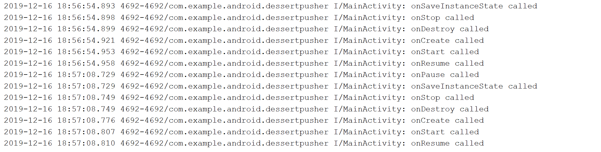

# Entwicklung von Android Apps mit Udacity Kurs :computer:

## :bookmark_tabs: Inhaltsverzeichnis
- [Kurs](https://classroom.udacity.com/courses/ud9012)
- [Lesson 1](#scroll-Lesson-1)
- [Lesson 2](#scroll-Lesson-2)
- [Lesson 3](#scroll-Lesson-3)
- [Lesson 4](#scroll-Lesson-4)
- [Lesson 5](#scroll-Lesson-5)


## :scroll: Lesson 1 

### 1.1 Welcome to Developing Android Apps
In dieser Lektion werden die Vorraussetzungen beschrieben: Einen starken Rechner sodass Android Studio problemfrei laufen kann und Kotlin Kenntnisse

### 1.2 Dice Roller
In dieser Lektion soll man das Android Studio installieren und es wird erklärt welche App wir als erstes erstellen. Es wird erklärt wie man die App von Grund auf erstellt und weiter wie man images und interactive Buttons erstellt.

### 1.3 Installing Android Studio
In dieser Lektion wird erklät wie man das Android Studio installiert.

### 1.4 Creating the Dice Roller Project: Written Instructions
In dieser Lektion wird beschrieben wie man das Projekt anlegt:

- Start a new Android Studio Project
- Choose your project: Empty Activity
- Configure your Project: Name: Dice Roler, Package Name: com.example.android.diceroller, Language: Kotlin, Minimum API Level: API 19
- Fertig

### 1.5 Running your First App
Hier wird erklärt das man die App auf einem virtuellen Handy(Emulator) laufen lassen kann oder auf einem echten Gerät(Handy, Tablet).

### 1.6 Running your First App on an Emulator
In dieser Lektion lernt man wie man einen Emulator konfiguriert und startet:
- Öffne AVD Manager
- Create new Virtual Device
- Hardware auswählen(Handy, TV, Wear OS, Tablet)
- API Level auswählen und downloaden
- Danach startet die App mit dem ausgewählten Emulator

### 1.7 Running your first App on a Device
In dieser Lektion wird gezeigt wie man Android Apps auf ein echtes Gerät deployed:
- Einstellungen -> Geräteinformationen -> auf Bildnummer drücken bis der Entwicklermodus aktiviert ist
- Einstellungen -> Entwickleroptionen -> USB-Debugging zulassen

### 1.8 Student Interview: Part 1 
In dieser Lektion sprechen verschiedene Personen von der ganzen Welt über diesen Android Kurs und die meisten sind sehr begeistert.

### 1.9 Main App Anatomy
In dieser Lektion wird die Struktur(Ordner/Files die erstellt werden) einer Android App erklärt:
- AndroidManifest.xml -> Hier steht alles drinnen was das OS System wissen muss um die App zu starten
- Gradle scripts builden  die App
- Kotlin files für die Kernlogic der App
- res Ordner(für static Content: layout, Strings, Icons, Images)

### 1.10 Quiz App Anatomy


### 1.11 Activity and Layout
Zu einer Activity Klasse gehört immer ein XML File.
In der Activity Klasse(Kotlin Code) ist drinnen was die App machen soll(die Logik).
Im XML-File ist das Layout, sprich wie die App ausschaun soll. Gemeinsam verbunden sind die beiden Files mit Layout Inflation.


### 1.12 Exercise: Hello Android
In dieser Lektion wird der Text im Xml File von "Hello World" auf "Hello Android" geändert.

### 1.13 Adding the Button
In dieser Lektion wird erklärt wie man einen Button zur App hinzufügt.

### 1.14 Exercise: Adding the Button    
In dieser Lektion muss man die Übung von Lektion 1.13 auf das Project DiceRoller übertragen

### 1.15 Connecting the Button
Man lernt wie man einen Button mit der Activity Klasse verbindet. 
- Man gibt den Button eine Id, diese Id wird in der R Classe gespeichert.
- Von der MainActivity.kt kann der button mittels: 
``` findByViewId(R.id.roll_button) ```

### 1.16 Exercise: findByViewId
In dieser Übung wird der Text vom Button in der Kotlin Klasse geändert

### 1.17 Exercise: OnClickListener
Bei dieser Übung wird darauf reagiert wenn man auf den Button klickt. Es wird eine Toast benachrichtigung verschickt.
```
 rollButton.setOnClickListener {
    Toast.makeText(this, "button clicked", Toast.LENGTH_SHORT).show()
} 
```

### 1.18 Exercise: Change the Text 
In dieser Übung wird wenn man auf den Button klickt verschiedene Zahlen ausgegeben mittels der Random Klasse 
```
private fun rollDice() {
        val resultText: TextView = findViewById(R.id.result_text)
        val randomInt = Random().nextInt(6) + 1
        resultText.text = randomInt.toString()
    }
```

### 1.19 Dice Images
Dies ist ein Einführungsvideo zu der nächsten Übung, in welcher wir die erzeugten Zahlen in Images umwandeln

### 1.20 Adding the Image Resource
Images werden in den Folder drawable gegeben

### 1.21 Exercise the ImageView
In dieser Übung werden die Zahlen mit Images getauscht.
Mit der when Expression
```
val drawableResource = when (randomInt) {
            1 -> R.drawable.dice_1
            2 -> R.drawable.dice_2
            3 -> R.drawable.dice_3
            4 -> R.drawable.dice_4
            5 -> R.drawable.dice_5
            else -> R.drawable.dice_6
        }
```
### 1.22 Student Interview: Part 2
In dieser Lektion wurden wieder Studenten interviewt wie es ihnen ging damit Android zu lernen.

### 1.23 Exercise: Finding Views Efficiently
findViewById ist sehr performancelastig. Mit lateinit wird der Variable ein Wert zugewiesen beim ersten Aufruf, somit kann es nicht null sein. Dies wird gemacht für eine bessere Performance

### 1.24 Namespaces
Im XML gibt es verschiedene Namespaces. Wenn man zb. ein Image in der Preview sehen möchte aber nicht beim start so kann man bei Tools das Image eingeben was man in der Preview sehen möchte.
```
    android:src="@drawable/empty_dice"
    tools:src="@drawable/dice_1"/>
```
### 1.25 Introduction to Gradle
Gradle ist das Build Tool für Android. Es steuert verschiedene Dinge wie: kompilieren, dependency management, führt automatische Tests aus,... 
<p>Aus diesen Ressourcen wird ein APK File erstellt. Diese File wird dann auf dem Device installiert.

### 1.26 Build.gradle
Gradle Files beinhalten dependencies, plugins, die sdk Version, eine ApplicationId(darf nur einmal auf dem Device vorhanden sein)

### 1.27 Android Compatibility
Android läuft auf verschiedene Geräte(Tv, Tablet, Handy,...). Darum sind API Levels wichtig. Je niedriger das API-Level desto mehr Geräte können die App starten. 
Im Gradle sieht man die mindest SdkVersion die dein Device zum starten braucht.

```
android {
    compileSdkVersion 28
    defaultConfig {
        applicationId "at.htl.diceroller"
        minSdkVersion 19
        targetSdkVersion 28
        versionCode 1
        versionName "1.0"
        testInstrumentationRunner "androidx.test.runner.AndroidJUnitRunner"
    }
```

### 1.28 Exercise: Vector Drawables
Siehe im Projekt

### 1.29 Recap
In dieser Lektion wird die Lesson noch einmal zusammengefasst was man lernte:
- Setup Android Studio
- Setup device or emulator
- Basic App Structure
- Layouts, Activities and Inflation
- Interaction via Button

## :scroll: Lesson 2

### 2.1 Art with Alexs
In dieser Einführungslektion erfahren wir das es in dieser Lesson über Layouts(Constraint Layout) gehen wird.

### 2.2 Introduktion
Hier wird erklärt das wir in dieser Lektion auch über verschiedene Arten von views und resources. Weiters lernen wir wie man den Android Studios Layout Editor verwendet. 

### 2.3 View Groups & View Hierarchy
In dieser Lektio lernt man über die View Hierarchy und View Groups.


### 2.4 Create the AboutMe Project
In dieser Lektion wird das Projekt AboutMe erstellt.

### 2.5 Exercise: Create the Layout File
In diser Übung wird das activity_main.xml File erstellt falls es noch nicht vorhanden ist.

### 2.6 Layout Editor Basics
In dieser Lektion werden alle Teile vom Layout Editor erklärt.
Anschließend gab es wieder ein Quiz darüber. 

### 2.7 Adding a TextView
In dieser Lektion habe ich eine TextView hinzugefügt. Weiters habe ich den Text unter Attribute und die Schriftgröße bei textSize geändert.
Unter Attribute -> neben den Text kann man den Ressourcen Editor öffnen. Im Ressourcen Manager rechts oben kann man eine neue String Value Resource anlegen 


### 2.8 Styling a TextView
In dieser Lektion wird der Text durch Margin und Padding ausgerichtet. Weiters wurde eine andere Font eingestellt(Roboto).

### 2.9 Exercise: Add a Textview, Imageview, and Styling
Unter common habe ich in dieser Lektion eine neuen Image hinzugefügt(btn_star_big_on). Weiters habe ich die Id des Images geändert. Weiters habe ich noch eine neue String resource angelegt(Diese resource wird von Screen Readers benutzt um ein Image zu beschreiben) und margin hinzugefügt.

### 2.10 Exercise: Add a Scrollview
In dieser Lektion gab ich der App eine ScrollView. Der ScrollView habe ich eine ID gegeben, sodass die scroll position erhalten bleibt wenn ich das Handy drehe.
In der ScrollView habe ich einen Text hinzugefügt. 
Somit kann ich beim Text nach unten und oben scrollen.


### 2.11 Adding an EditText for Text Input
In dieser Lektion habe ich eine EditBox hinzugefügt(Text -> Plain Text).

### 2.12 Adding a Done Button to Accept Text Input
In dieser Lektion wir ein neuer Button und eine TextView hinzugefügt.

### 2.13 Exercise: Add EditText, Done Button, ClickHandler
In dieser Lektion gab ich dem Button eine Logik.
```
 findViewById<Button>(R.id.done_button).setOnClickListener {
            addNickname(it)
        }
 ```
 Wenn der Button gedrückt wird, wird die Methode addNickname ausgeführt.

 ### 2.14 Data Binding
 In dieser Lektion lernt man darüber wie Data Binding funktioniert.
 

### 2.15 Data Binding: Views
Um Data Binding nutzen können muss man DataBinding im build.gradle(Module:app) aktivieren.

```
 dataBinding {
        enabled = true
    }
````
Als nächstes müssen wir unser xml layout mit einen Layout tag einwickeln.
Danach kann man ein Binding Object im Main Activity Kotlin file erstellen: 
```
private lateinit var binding: ActivityMainBinding
``` 
### 2.16 Data Binding: Data
In dieser Lektion wird erklärt wie man eine neue Kotlin Klasse erstellt. Statt einer String ressource verwenden wir jetzt eine Klasse.

### 2.17 Exercise: Implement Data Binding
In dieser Lektion wird das gelernte aus der Lektion davor auf unser Projekt übertragen.

### 2.18 Google Interview: John Hoford and Nicolas Roard
In dieser Lektion werden wieder Personen interviewt.

### 2.19 Constraint Layout: ColorMyViews App
Das Constraint Layout sind Bedingungen für UI-Elemente, die zur Positionierung derer dienen.  Sie beschreiben relative Abhängigkeiten zwischen den einzelnen Elementen. Es können Constraints für eine oder mehrere Seiten eines Elements definiert werden. Es sind aber mindestens so viele Constraints nötig, dass jedes Element eindeutig positioniert werden kann. ConstraintLayout bietet die Möglichkeit sogenannte Side-Connections, Side-Alignments und Baseline-Alignments festzulegen.

### 2.20 Exercise: Create ColorMyViews Project and One Box
In dieser Lektion wird ein neues Projekt angelegt.

### 2.21 Exercise: Create ColorMyViews Project and One Box
In diesem Projekt schalten wir als erstes die Autoconnection ab, da wir die Constraints manuell hinzufügen.

Es werden weiters erklärt wie man zwischen verschiedene Display Auflösungen wechseln kann.

### 2.22 Constraints
In dieser Lektion lernt man noch mehr über Constraints.

### 2.23 Ratio
Ratios(Verhältnisse) sind am nützlichsten, wenn das Layout Views enthält, deren Form / Seitenverhältnis auch dann erhalten bleiben muss, wenn sich die Ausrichtung oder die Abmessungen des Bildschirms ändern.

### 2.24 Chaining
Eine Chain ist eine Gruppe von Views die mit bidirektionalen position constraints miteinander verknüpft sind.  

### 2.25 Adding Box Two Below Box One
In dieser Lektion wird eine neue TextView hinzugefügt.

### 2.26 Adding Three Aligned Boxes
In dieser Lektion werden weitere 3 TextViews hinzugefügt. Wir verwenden flexible Constraints, sodass die Ordnung im Landscape Modus aufrechterhalten bleibt.


Das obere Bild zeigt den Portrait Modus und das untere Bild den Landscape Modus.

### 2.27 Exercise: Add Aligned Boxes with Click Handlers
In dieser Lektion sind alle TextViews am Anfang weiß und sobald man auf die TextView klickt werden die Farben geändert und die Hintergrund Farbe, wenn der User den Screen berührt.^

### 2.28 Baseline Constraint
Baseline-Alignment: Ist die Ausrichtung an der Baseline eines anderen UI-Elements, um z.B. den Textinhalt von verschiedenen UI-Elementen gleich anzuordnen.

### 2.29 Exercise: Add Baseline Constraint and Button Chain
In dieser Lektion werden 3 Buttons hinzugefügt, und mit Baseline Constraint verbunden. Weiters werden den Buttons String Resourcen gegeben. Farben werden gesetzt wenn auf den jeweilign Button draufgedrückt wird.

### 2.30 Where you go next?
In diesem Video wird nochmal zusammengefasst was wir in dieser Lesson gelernt haben.

## :scroll: Lesson 3

### 3.1 The Guide and the Traveler
In dieser Lektion wird erklärt was wir in dieser Lesson lernen. In dieser Lesson wird gezeigt wie man apps erzeugt die multiple screens beinhalten. Es wird gezeigt wie man diese xml files miteinander verbindet(map, navigation path).

### 3.2 Android Navigation Patterns
In diesem Video wird erklärt wie Navigation funktioniert am folgenden Beispiel und das eine Activity mehrere Fragments beinhalten kann.


### 3.3 Quiz: Navigation Terms
In dieser Lektion gibt es ein Quiz über Navigation Terms.

### 3.4 Fragments
In Android 3.0 Honeycomb wurden fragments hinzugefügt. Eine Activity kann mehrere UI Fragments beinhalten. Man kann zwischen den verschieden Fragments einer Activity navigieren. 

### 3.5 Quiz: Fragment Basics
In dieser Lektion gibt es ein Quiz über Fragments.

### 3.6 Exercise: Project Tour
Im AndroidManifest.xml ist festgelegt welche Acitivity am Anfang gestartet wird. Im res Ordner werden Animationen, drawables, Layouts, menu(für navigation), mipmap(png icons) und values(Konstanten für Farben, Strings, Styles, ...) gespeichert.

### 3.7 Exercise: Creating and Adding a Fragment
In dieser Lektion lernen wir wie man ein Fragment erstellt.

``` File -> New -> Fragment -> Fragment(Blank) ```
Weiters wurde in der Übung ein Fragment zum main layout hinzugefügt.

### 3.8 Navigation Component
Prinzipien von Navigation Component:
- Die App hat einen fixen Startpunkt.
- Man sollte immer zurück navigieren können.
- Der Up Button sollte immer angezeigt werden (Außer auf der Startseite)

### 3.9 Exercise: Let’s Navigate Already
In dieser Lektion erstellen wir einen Navigation Graph:
- Zuerste erstellen wir ein neues file im Ressource Ordner
  (File name: navigation, Resoure Type: Navigation)
- Fragment name und id ändern im activity_main xml, weiters navGraph und defaultNavHost hinzufügen
- Fragments im Navigation xml auswählen
- ClickListener im TitleFragment.kt(Wechseln eines Fragments):
```
binding.playButton.setOnClickListener(
                Navigation.createNavigateOnClickListener(R.id.action_titleFragment_to_gameFragment)
)
```

### 3.10 Principles of Navigation
Die Prinzipien von Navigationen werden nochmals wiederholt(Siehe Punkt 3.8)

### 3.11 Exercise: Conditional Navigation
In dieser Lektion werden die Fragments: GameWon und GameOver hinzugefügt.

### 3.12 Exercise: Back Stack Manipulation
Das Problem hier ist wenn man am Handy auf die Zurücktaste klickt navigiert man einfach eine Frage zurück und kann sie dann richtig beantworten. Um dieses Problem zu vermeiden muss man das Fragment vom Backstack löschen.

### 3.13 Quiz: Back Stack Manipulation
In dieser Lektion gibt es ein Quiz über Back Stack Manipulation

### 3.14 Exercise: Adding Support for the Up Button
Ein Up Button links oben(nicht immer) wurde hinzugefügt zum zurück navigieren.

### 3.15 Quiz: Android Navigation - Up vs Back
In dieser Lektion gibt es wieder ein Quiz über Back and Up Button.

### 3.16 Google Interview: Ian Lake
Ein Interview mit Ian Lake.

### 3.17 Exercise: Adding a Menu
Das About Fragment wird im Overflow Menü hinzugefügt.

### 3.18 Quiz: Matching Menu Attributes
Quiz über Attribute und ihre funktion(zb. Id, title,...).

### 3.19 Exercise: Adding Safe Arguments
In dieser Lektion werden Argumente zwischen 2 Fragmente (zb. A und B) übergeben(Anzahl der Fragen, Anzahl der richtig beantworteten Fragen) SafeArgs wird verwendet, um Bugs aufgrund von verschiedenen Datentypen zu verhindern. 

### 3.20 Why do we have Safe Arguments?
Quiz über SafeArgs. 

### 3.21 Intents und Sharing
In diesem Video wird erklärt was Intenst und Sharing bedeutet. Intents braucht man man wenn man z.B auf Kontakte zugreifen möchte, oder die Kamera öffnen möchte. Mit Sharing kann man z.B Texte über Social Networks, e-mail, ... mit anderen Usern teilen.

### 3.22 Quiz: Explicit vs Implicit Intents
Quiz über intent type.

### 3.23 Exercise: Adding Sharing with an Intent
Nach dieser Lektion kann man sein Ergebnis mit anderen Teilen.


### 3.24 Exercise: Adding the Navigation Drawer
In dieser Lektion wird ein Navigation Drawer hinzugefügt.

### 3.25 Summary of Navigation
Die Lesson 3(Navigation) wird nochmal zusammengefasst.

### 3.26 Quiz: How to Navigate
Quiz über Navigation.

### 3.27 Exercise: Using Navigation Listeners
Folgender Code wird im MainActivity.kt hinzugefügt damit man während des Spieles nicht den Navigation Drawer öffnen kann.
```
navController.addOnDestinationChangedListener { nc: NavController, nd: NavDestination, args: Bundle? ->
            if (nd.id == nc.graph.startDestination) {
                drawerLayout.setDrawerLockMode(DrawerLayout.LOCK_MODE_UNLOCKED)
            } else {
                drawerLayout.setDrawerLockMode(DrawerLayout.LOCK_MODE_LOCKED_CLOSED)
            }
        }
```
### 3.28 Exercise: Animation with Navigation
In dieser Lektion werden ViewAnimations hinzugefügt. 

### 3.29 Quiz: Animation Attributes
Abschließendes Quiz über Animation Attribute.

## :scroll: Lesson 4 

### 4.1 The Case of the Missing Data
In dieser Lesson beschäftigen wir uns mit dem Android Activity Lifecycle. Das Problem ist zum Beispiel, wenn man das Handy dreht, dass die Daten verloren gehen. 

### 4.2 Why Track Activity State?


### 4.3 Exercise: Introduction to the Activity Lifecycle Diagram
Zustände einer Activity:
- Created
- Started
- Resumed
- Destroyed
- Initialized

Callback Methods:
- onCreate
- onStart
- onResume
- onDestroy
- onPause
- onStop
- onRestart

### 4.4 Exercise: Introduction to Logging
In dieser Lektion lernt man übers Logging. 
Ein Log Statement schaut folgendermaßen aus: ``` Log.i("MainActivity", "onStart called") ``` .
Im Logcat erhält man folgende Ausgabe: ``` 2019-10-31 13:40:07.436 3757-3757/com.example.android.dessertpusher I/MainActivity: onStart called ```.

### 4.5 Exercise: The Application Class and Timber
Es wird die Timber Logging Library vorgestellt.
Benefits:
- Generates tags
- Avoid logs in released app apks
- Easy integration with crash reporting

Timber Dependency im Gradle File hinzufügen: ``` implementation 'com.jakewharton.timber:timber:4.7.1' ```
In der Klasse zur Ausgabe: ``` Timber.i("onStart called") ``` implementieren.

### 4.6 Lifecycle: Open and Close
In dieser Lektion werden die Aufrufe der Lifecycle Methoden  geloggt. 
1. onCreate called
2. onStart called
3. onResume called
4. onPause called
5. onStop called
6. onDestroy called

### 4.7 Lifecycle: Share dialog
In dieser Lektion sehen wir welche Lifecycle Methoden aufgerufen werden wenn man etwas teilen möchte.

1. onPause called
2. onResume called

### 4.8 onCreate vs onStart
- onStart wird aufgerufen wenn die App geöffnet wird
- onCreate wird aufgerufen wenn die App erstellt wird

### 4.9 Activity Lifecycle States and Callbacks Summary
Das gelernte aus den vorherigen Lektion wird nochmal zusammengefasst.

### 4.10 Lifecycle: Navigate Away
Quiz! Man soll die App öffnen und im Logcat nachschauen welche Methoden in welcher Reihenfolge aufgerufen werden.
1. onPause
2. onStop
3. onRestart
4. onStart
5. onResume

### 4.11 Google Interview: Dianne Hackborn
Ein Interview mit Dianne Hackborn(Android Framework Tech Lead)

### 4.12 Exercise: Setup and Teardown
Um zu verhindern das ein Timer weiterläuft obwohl die Activity nicht sichtbar ist, kann man die Lifecycle Methoden onStart bzw. onStop verwenden. Startet man etwas in onCreate sollte man es in onDestroy wieder zerstören.

### 4.13 Introduction to the Lifecycle Library
Vor der Lifecycle Library war der einzige Weg mit einen fragment oder activity lifecycle zu interagieren mit callback methods die wir in dieser Lesson gelernt haben(Lifecycle Methods). Mit der Lifecycle Library ist es leichter erstellte Objekte wieder zu zerstören, so dass es zu keine Bugs kommt.

### 4.14 Exercise: Lifecycle Observation
LifecycleObserver:
- Observer of a LifecycleOwner, such as an Activity or Fragment

### 4.15 Process Shutdown
In diesem Video wird der Process Shutdown erklärt(wenn man die App verlässt soll die Activity nicht vernichtet werden).
Weiters wird dies in 4.16 näher beschrieben.

### 4.16 Process Shutdown Demo
Demo beispiel mit ADB Command

### 4.17 Exercise: onSaveInstanceState
In dieser Übung stellen wir sicher, dass die Daten gespeichert und wiederhergestellt werden, auch wenn unsere App im Hintergrund heruntergefahren wird.

### 4.18 Configuration Changes
In dieser Übung soll man das Handy drehen und schauen im Logcat welche Lifecycle Methoden aufgerufen wurden.


### 4.19 The Future of Lifecycles
Die Lesson wurde nochmal zusammengefasst.

## :scroll: Lesson 5

### 5.1 Architecting on the Fly
Einleitungsvideo

### 5.2 Lesson Introduction
In dieser Lesson lernen wir über: 
- Application Architekture
- ViewModel
- Live Data
- Data Binding

### 5.3 Exercise: Tour of the App
In diesem Video wird die App vorgestellt. 
Man muss Wörter erraten die ein anderer pantomimisch darstellt.

### 5.4 Where the App Falls Short
In diesem Video werden die Probleme gezeigt die wir auch beim vorigen Beispiel hatten. Wird das Handy gedreht so gehen die aktuellen Daten verloren(Spielstand, Punkte, ...). Man könnte es wie im vorigen Beispiel mit onSaveInstantState lösen, jedoch wird in dieser Lesson eine weitere Methode vorgestellt.